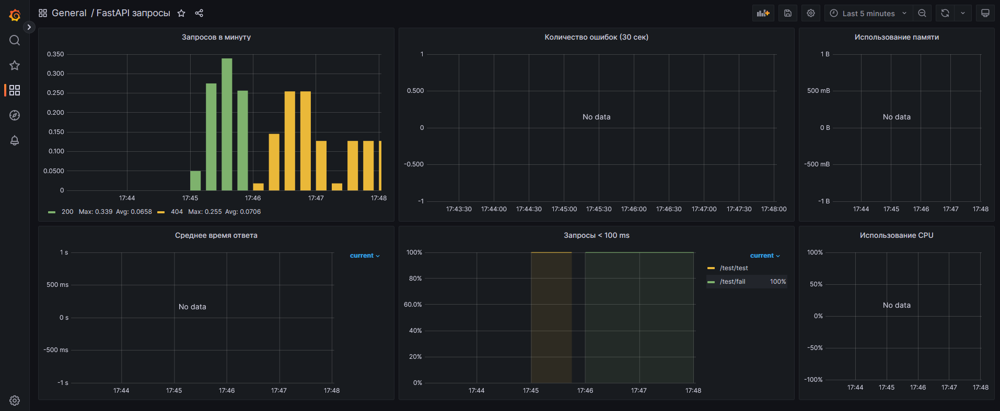

> [!Note]
> Для работоспособности необходимо установить chrome
# Neuro-cook-API 

Данный репозиторий представляет собой API для генерации рецептов с помощью GPT.

## Используемые технологии
API был разработан с использованием следующих технологий:
- Язык: Python 
- Фреймворк: FastApi
- Логи: Grafana
- Библиотека для генерации рецептов: https://github.com/xtekky/gpt4free

## Как использовать
#### Установка через Docker
1. Устанавливаем Docker https://docs.docker.com/get-docker/
2. Клонируем репозиторий
   ```commandline
   git clone https://github.com/ded2322/neuro_cook.git
   ```
3. Перейдите в папку c кодом
   ```commandline
   cd neuro_cook
   ```
4. Поднимаем docker-compose
   ```commandline
   docker-compose build
   ```
   ```commandline
   docker-compose up
   ```

#### Установка без докера
1. Установить python 3.10
2. Клонируем репозиторий
   ```commandline
   git clone https://github.com/ded2322/neuro_cook.git
   ```
3. Перейдите в папку c кодом
   ```commandline
   cd neuro_cook
   ```
4. Установите необходимые зависимости, выполнив команду:
   ```commandline
   pip install -r requirements.txt
   ```

5. Запустите сервер API, выполните команду:
   ```commandline
   uvicorn core.main:app --reload --port 8080
   ```


Путь до Swagger http://127.0.0.1:8000/docs#/

Интерфейс Swagger-а

#### Настройка Grafana
Гайд как настроить: https://youtu.be/X_g-eJqiiLo?si=-Gh2075QYuBO8JuI

Путь до Grafana http://127.0.0.1:3000/

Интерфейс Grafana